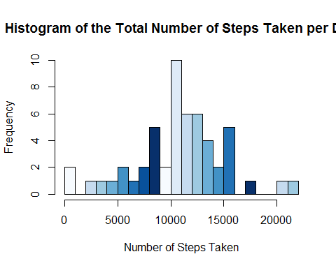
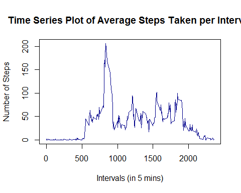
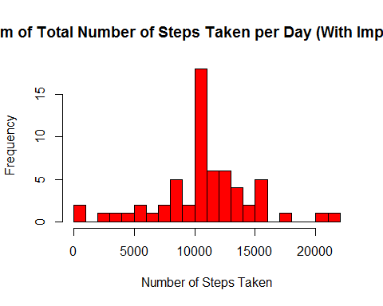
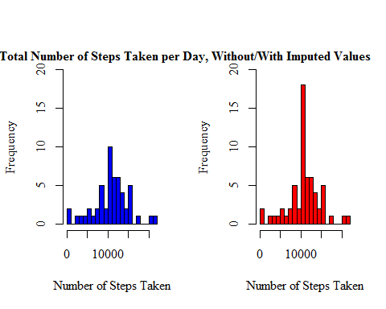
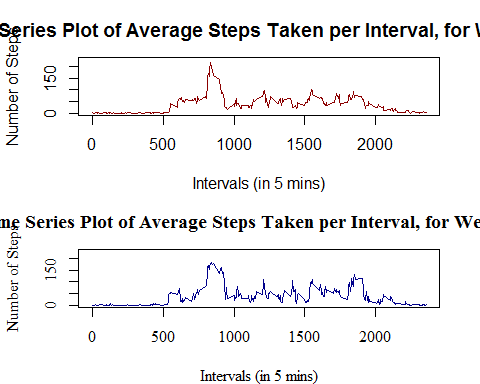

```{r setup, include=FALSE}
knitr::opts_chunk$set(echo = TRUE)
```

## Completing the Assignment
### Question 1: Loading and preprocessing the data
Reads into R
```{r} 
setwd("D:/RStudio/projects/First/")
initialData <- read.csv("activity.csv")
```
An initial look at the data confirms its dimensions and contents
```{r} 
head(initialData)
str(initialData)
```

### Question 2: What is mean total number of steps taken per day?
Removing the missing values 
```{r}
data <- initialData[!(is.na(initialData$steps)), ]
```
calculating the total number of steps taken per day
```{r}
totalStepsDay <- aggregate(steps ~ date, data, sum)
```

histogram is created to indicate the frequency of total steps taken each day

```{r}
hist(totalStepsDay$steps, breaks=20, xlab="Number of Steps Taken", 
     main="Histogram of the Total Number of Steps Taken per Day",
     col=blues9)
```


summarary function can calculate the mean and median values of the total number of steps taken per day

```{r}
summary(totalStepsDay$steps)
```
Therefore the mean value calculated is **10766.19**, and the median value **10765**


### Question 3: What is the average daily activity pattern?

Time plot should look at the average number of steps taken for each interval, the aggregate function is used. 

```{r}
meanStepsInterval <- aggregate(steps ~ interval, data, mean)

plot(x=meanStepsInterval$interval, y=meanStepsInterval$steps, type="l",
     main="Time Series Plot of Average Steps Taken per Interval",
     ylab="Number of Steps", xlab="Intervals (in 5 mins)",
     col="darkblue")
```


 maximum number of steps
 ```{r}
meanStepsInterval[grep(max(meanStepsInterval$steps), meanStepsInterval$steps), ]
```
So the interval with the maximum number of steps is interval **835**.


### Question 4: Imputing missing values

replace each missing value with the mean value for the same interval, averaged across all days.
```{r}
imputedData <- initialData
for(x in 1:17568) {
    if(is.na(imputedData[x, 1])==TRUE) {
        imputedData[x, 1] <- meanStepsInterval[meanStepsInterval$interval %in% imputedData[x, 3], 2]
    }
}
  
imputedTotalStepsDay <- aggregate(steps ~ date, imputedData, sum)
head(imputedTotalStepsDay)
```

```{r}
hist(imputedTotalStepsDay$steps, breaks=20, xlab="Number of Steps Taken", 
     main="Histogram of Total Number of Steps Taken per Day (With Imputed Values)",col="red")
```


 mean and median total number of steps taken per day
 
 ```{r}
imputedStepsSummary <- summary(imputedTotalStepsDay, 
                                 meanOfTotalSteps=mean(imputedTotalStepsDay$steps), 
                                 medianOfTotalSteps=median(imputedTotalStepsDay$steps))
                                 
mean <- mean(imputedTotalStepsDay$steps)
median <- median(imputedTotalStepsDay$steps)

mean 
median
                                
```
histograms of the two data sets (imputed and non-imputed) are compared:

```{r}
par(mfrow = c(1, 2))
hist(totalStepsDay$steps, breaks=20, xlab="Number of Steps Taken", 
     col="Blue", family="serif", ylim=c(0, 20), main=NULL)
hist(imputedTotalStepsDay$steps, breaks=20, xlab="Number of Steps Taken", 
     col="Red", family="serif", ylim=c(0, 20), main=NULL)
mtext("Histograms of Total Number of Steps Taken per Day, Without/With Imputed Values",
      adj=0.95, family="serif", font=2)
```



```{r}
length(unique(data$interval))
```

missing observations are due to entirely missed days, (8 of the days) where no measurements were made whatsoever

### Question 5: Are there differences in activity patterns between weekdays and weekends?

used the weekdays function to automatically calculate the day of the week
```{r}
library(lubridate)
daysData <- imputedData
daysData$days <- weekdays(as.Date(daysData$date))
daysData$weekday <- as.character(rep(0, times=17568))
for(x in 1:17568) {
    if(daysData[x, 4] %in% c("Saturday", "Sunday")) {
        daysData[x, 5] <- "weekend"
    } else {
        daysData[x, 5] <- "weekday"
    }
}
daysData$weekday <- factor(daysData$weekday)
head(daysData)
```


```{r}
weekdayData <- daysData[daysData$weekday=="weekday", ]
weekendData <- daysData[daysData$weekday=="weekend", ]
```

average number of steps per interval is calculated
```{r}
weekdayMean <- aggregate(weekdayData$steps, list(weekdayData$interval), mean)
weekendMean <- aggregate(weekendData$steps, list(weekendData$interval), mean)
```

panel plot is created

```{r}
par(mfrow=c(2, 1), mar=c(4, 4.1, 3, 2.1))
plot(weekdayMean$Group.1,weekdayMean$x, type="l",
     main="Time Series Plot of Average Steps Taken per Interval, for Weekdays",
     xlab="Intervals (in 5 mins)", ylab="Number of Steps",
     col="darkred", lwd=1.5, ylim=c(0, 230))
plot(weekendMean$Group.1, weekendMean$x, type="l",
     main="Time Series Plot of Average Steps Taken per Interval, for Weekends",
     xlab="Intervals (in 5 mins)", ylab="Number of Steps", family="serif",
     col="darkblue", lwd=1.5, ylim=c(0, 230))
```


